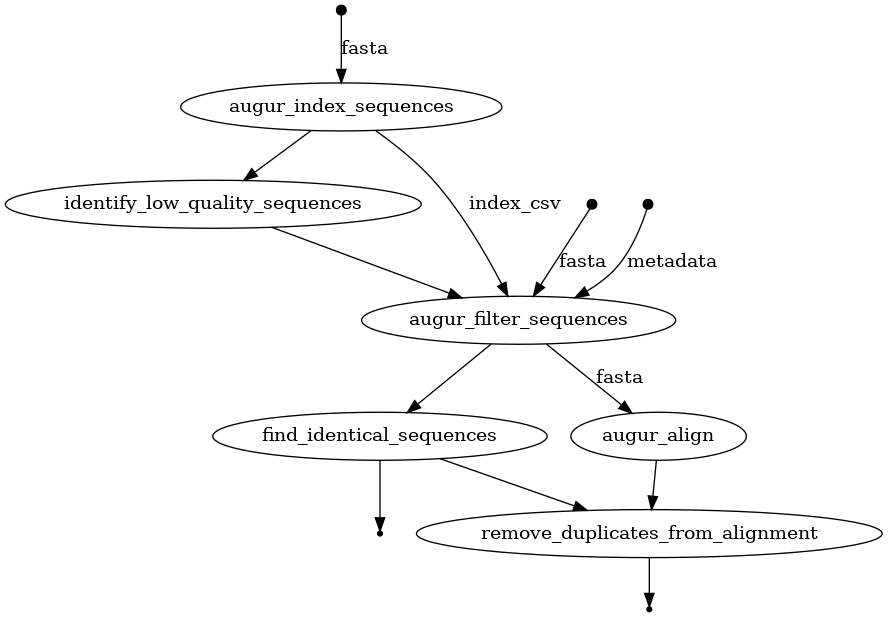

PZH phylogenetic pipeline
=========================

This project is part of [PleEpiSeq](https://www.pzh.gov.pl/projekty-i-programy/plepiseq/) project. This repository contains a Nextflow pipeline for phylogenetic analysis of viral sequences. The pipeline is designed to be modular and can be easily extended to include additional steps or tools.

Pipeline overview
-----------------


Quick start
-----------

1. Install [Nextflow](https://www.nextflow.io/docs/latest/install.html)
2. Install [Docker](https://docs.docker.com/engine/install/)
3. Clone this repository
4. Build docker image
   ```bash
   docker build -t pzh_pzh-phylogenetic .
   ```
5. Run the pipeline on example data:
   ```bash
   ./run_viral_pipeline.sh
    ```


Related projects
----------------

The pipeline loosely originates from [NextStrain Zika Tutorial](https://github.com/nextstrain/zika-tutorial)

Another project related to PleEpiSeq is [Sequnecing pipline](https://github.com/mkadlof/pzh_pipeline_viral).